# CodeNova — Online Coding Practice & Skill Assessment Management Platform

[](https://code-nova-psi.vercel.app)
[](https://spring.io/projects/spring-boot)
[](https://react.dev/)
[](https://www.mysql.com/)
[](https://microsoft.github.io/monaco-editor/)

A full-stack, enterprise-grade online coding practice, proctored skill assessment, contest management, and support ticketing platform. Built with a React 18 single-page application, Spring Boot 3.3.4 REST API, MySQL 8.4 database, and a real server-side multi-language code execution engine.

---

## 🚀 Live Demo & Artifacts

- 🌐 **Live Web Application (Vercel)**: **[https://code-nova-psi.vercel.app](https://code-nova-psi.vercel.app)**
- 📁 **Complete Project Visuals Archive (Google Drive)**: **[View All High-Resolution Screenshots](https://drive.google.com/drive/folders/11YsT042SkuQ-w6gSjmh5KoVbhFb7c7ry)**

---

## Table of Contents

- [Live Demo & Artifacts](#-live-demo--artifacts)

- [Project Overview](#project-overview)
- [Key Features](#key-features)
- [Technology Stack](#technology-stack)
- [Architecture Overview](#architecture-overview)
- [Project Structure](#project-structure)
- [Getting Started](#getting-started)
  - [Prerequisites](#prerequisites)
  - [Clone Repository](#clone-repository)
- [Installation](#installation)
  - [Backend Setup](#backend-setup)
  - [Frontend Setup](#frontend-setup)
- [Cloud Deployment Guide](#cloud-deployment-guide)
- [Configuration & Environment Variables](#configuration--environment-variables)
- [Running the Project](#running-the-project)
- [Screenshots & Visual Demo](#screenshots--visual-demo)
- [API Overview](#api-overview)
- [Execution & Proctoring Engine](#execution--proctoring-engine)
- [Support Ticketing & Email System](#support-ticketing--email-system)
- [Demo Credentials](#demo-credentials)
- [Author](#author)

---

## Project Overview

**CodeNova** is an end-to-end coding education and assessment ecosystem designed to streamline developer practice, skill evaluations, and competitive programming. Unlike basic mock judges, CodeNova features:
1. **Real Server-Side Execution**: Evaluates candidate code against hidden and visible test cases using native OS compilers and reflective Java test drivers.
2. **Skill Assessments & Contests**: Timed, proctored environments with automated scoring, deadline enforcement, and anti-cheat event monitoring.
3. **Multi-Role Experience**: Distinct interfaces for **Candidates/Students**, **Verified Organization Hosts**, and **Platform Administrators**.
4. **Interactive Support Ticketing**: Threaded candidate-admin support desk with internal staff notes and asynchronous transactional email notifications.
5. **Global Accessibility**: Full internationalization supporting 105+ world languages and an AI-powered conversational pair programmer.

---

## Key Features

### 1. Developer Practice & Problem Solving
- **Interactive Monaco Editor**: Industry-standard code editor with multi-language syntax highlighting, bracket matching, code folding, and starter templates.
- **Run vs. Submit**: "Run" validates visible sample cases without database persistence; "Submit" runs full hidden test suites and persists submission history.
- **Languages Supported**: Java 17+ (Solution-class reflective execution), Python 3, C++, and JavaScript (Node.js).
- **Progress Tracking**: Personal submission history, performance metrics, problem difficulty breakdown, and streak heatmaps.

### 2. Proctored Skill Assessments
- **Timed MCQ & Programming Evaluations**: Single/multiple-choice questions and coding challenges with automated evaluation.
- **Atomic Answer Recording**: Non-blocking answer saves with immediate candidate state preservation.
- **Anti-Cheat Monitoring**: Tracks browser tab-switches and fullscreen exits with automated attempt termination upon threshold violations.
- **Instant Result Summaries**: Detailed scoring breakdowns, answer keys (post-submission), and automated result emails.

### 3. Contests & Leaderboards
- **Competitive Contests**: Scheduled programming contests with real-time countdown clocks and synchronized registration.
- **Live Leaderboard**: Real-time ranking with dynamic scoring based on speed, accuracy, and penalties.
- **Candidate Notifications**: Automated broadcast emails sent to registered candidates upon contest publication.

### 4. Organization Host Verification
- **Host Application**: Educational institutions and corporate organizations apply for host privileges with document verification.
- **Admin Review Lifecycle**: Admins verify or reject host requests with structured audit notes and automated email status notifications.
- **Hosted Assessments**: Verified hosts create private assessments and monitor candidate participation analytics.

### 5. Enterprise Support & Feedback Desk
- **Multi-State Ticket Lifecycle**: `OPEN` ➔ `IN_PROGRESS` ➔ `WAITING_FOR_YOU` ➔ `RESOLVED` ➔ `CLOSED`.
- **Threaded Communication**: Candidate-staff dialogue with screenshot attachment support.
- **Internal Staff Notes**: Private admin notes hidden from candidate view.
- **Asynchronous Email Alerts**: Real-time transactional emails on ticket creation, staff replies, status changes, and resolutions.

### 6. Administration, Reports & Analytics
- **Platform Analytics**: Dynamic date-filtered charts for user registrations, submission verdicts, language distribution, and contest metrics.
- **CSV Data Export**: One-click real-time metric export.
- **Content Management**: Full CRUD for problems, test cases, editorials, hints, and certificates.

---

## Technology Stack

| Layer | Technology | Description |
|---|---|---|
| **Frontend Client** | React 18, Vite | High-performance single page application |
| **Routing & UI** | React Router v6, Lucide React, Tailwind CSS / Vanilla CSS | Responsive design system |
| **Code Editor** | `@monaco-editor/react` | Microsoft Monaco code editing engine |
| **Backend API** | Java 17+, Spring Boot 3.3.4 | RESTful microservice architecture |
| **Security & Auth** | Spring Security, JWT (Stateless), BCrypt | Role-based access control (`ROLE_USER`, `ROLE_ADMIN`) |
| **Persistence** | Spring Data JPA, Hibernate, MySQL 8.4 | Relational database with transactional consistency |
| **Code Execution** | `ProcessBuilder` (Native OS Shelling) | Real compilation and execution (`javac`, `python`, `g++`, `node`) |
| **Email Infrastructure**| Spring Mail, `JavaMailSender`, SMTP | Asynchronous HTML transactional email delivery |
| **PDF Generation** | Apache PDFBox 2.0.29 | Dynamic, verifiable certificate generation |
| **Internationalization**| Custom i18n Engine | 105+ language translations with persistence |

---

## Architecture Overview

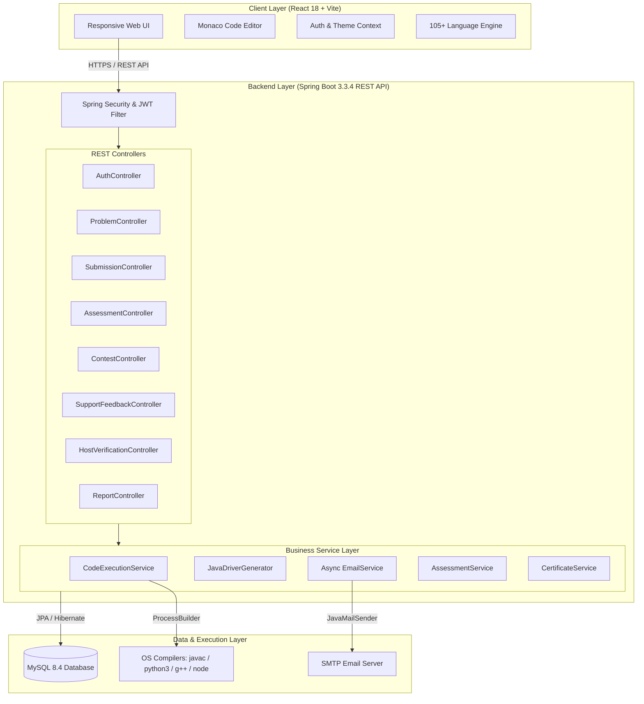

---

## Project Structure

```
Online_Coding_Practic/
├── backend/
│   ├── src/
│   │   ├── main/
│   │   │   ├── java/com/oj/platform/
│   │   │   │   ├── config/          # Security, Mail, WebMvc configurations
│   │   │   │   ├── controller/      # REST API Controllers
│   │   │   │   ├── dto/             # Data Transfer Objects & Requests
│   │   │   │   ├── entity/          # JPA Entities (User, Problem, Submission, etc.)
│   │   │   │   ├── exception/       # Global exception handlers
│   │   │   │   ├── repository/     # Spring Data JPA Repositories
│   │   │   │   ├── security/        # JWT Token Provider & Filters
│   │   │   │   ├── service/         # Business Logic & Code Execution Engines
│   │   │   │   └── util/            # String parsing & output comparison utilities
│   │   │   └── resources/
│   │   │       ├── application.properties
│   │   │       └── data.sql         # Seed data (Users, Problems, Test cases)
│   │   └── test/                    # 35+ Unit & Integration Test Suites
│   ├── pom.xml                      # Maven Dependencies
│   └── mvnw / mvnw.cmd              # Maven Wrapper
│
├── frontend/
│   ├── public/                      # Static assets & favicons
│   ├── src/
│   │   ├── components/              # Shared UI components (Navbar, Sidebar, Monaco, Chatbot)
│   │   ├── context/                 # AuthContext & ThemeContext
│   │   ├── i18n/                    # Locale dictionaries (105+ languages)
│   │   ├── pages/
│   │   │   ├── admin/               # Admin Management & Analytics Pages
│   │   │   ├── auth/                # Split-Screen Login & Register Pages
│   │   │   └── user/                # Candidate Dashboard, Problems, Assessments, Contests
│   │   ├── services/                # Axios API service integrations
│   │   ├── utils/                   # Helper functions & time utilities
│   │   ├── App.jsx                  # Router configuration
│   │   └── main.jsx                 # Entry point
│   ├── package.json
│   └── vite.config.js
│
├── screenshots/                     # 80+ UI Screenshots & Visual Artifacts
├── DEMO_CHECKLIST.md                # Evaluation & Presentation Walkthrough Guide
├── .gitignore                       # Repository ignore rules
└── README.md                        # Documentation
```

---

## Getting Started

### Prerequisites

Ensure you have the following installed on your machine:
- **Java Development Kit (JDK)**: Version 17 or higher
- **Node.js**: Version 18.x or higher & `npm`
- **MySQL Server**: Version 8.0 or 8.4
- **Compilers (for code execution)**:
  - Java: `javac` / `java` (comes with JDK 17+)
  - Python: `python` or `python3`
  - C++: `g++` (MinGW or GCC)
  - JavaScript: `node`

### Clone Repository

```bash
git clone -b Shreya-K https://github.com/Springboard-Internship-2026/Development-of-an-Online-Coding-Practice-and-Skill-Assessment-Management-Platform-AUG-2026.git
cd Development-of-an-Online-Coding-Practice-and-Skill-Assessment-Management-Platform-AUG-2026
```

---

## Installation

### Backend Setup

1. **Create MySQL Database**:
   ```sql
   CREATE DATABASE coding_platform CHARACTER SET utf8mb4 COLLATE utf8mb4_unicode_ci;
   ```

2. **Configure Database Credentials**:
   Edit `backend/src/main/resources/application.properties` (or set environment variables):
   ```properties
   spring.datasource.url=jdbc:mysql://localhost:3306/coding_platform?useSSL=false&serverTimezone=UTC&allowPublicKeyRetrieval=true
   spring.datasource.username=root
   spring.datasource.password=your_password
   ```

3. **Build and Test Backend**:
   ```bash
   cd backend
   ./mvnw clean test
   ```

### Frontend Setup

1. **Install Dependencies**:
   ```bash
   cd frontend
   npm install
   ```

2. **Build for Production**:
   ```bash
   npm run build
   ```

---

## Cloud Deployment Guide

### 1. Frontend Deployment on Vercel
1. Go to [Vercel](https://vercel.com) and click **"Add New Project"**.
2. Select your repository and choose the **`Shreya-K`** branch.
3. Configure Project Settings:
   - **Root Directory**: `frontend`
   - **Framework Preset**: `Vite`
   - **Build Command**: `npm run build`
   - **Output Directory**: `dist`
4. Add Environment Variable:
   - `VITE_API_BASE_URL` = `https://your-backend-service.onrender.com/api` *(your deployed backend URL)*
5. Click **Deploy**. Vercel will deploy the client and provide a live `https://*.vercel.app` URL.

### 2. Backend & MySQL Deployment on Render
1. Go to [Render](https://render.com) and connect your GitHub account.
2. **Create MySQL Database**:
   - Click **"New +"** ➔ **"PostgreSQL"** or use a free managed MySQL service (e.g., [Aiven](https://aiven.io) / [Railway](https://railway.app)).
3. **Create Backend Web Service**:
   - Click **"New +"** ➔ **"Web Service"**.
   - Select your repository and **`Shreya-K`** branch.
   - **Environment**: `Docker` (using `backend/Dockerfile`).
   - **Docker Context**: `backend`
   - **Environment Variables**:
     - `PORT` = `8080`
     - `SPRING_DATASOURCE_URL` = `jdbc:mysql://<host>:<port>/<dbname>?useSSL=false&allowPublicKeyRetrieval=true&serverTimezone=UTC`
     - `SPRING_DATASOURCE_USERNAME` = `<username>`
     - `SPRING_DATASOURCE_PASSWORD` = `<password>`
     - `FRONTEND_URL` = `https://your-frontend.vercel.app`
4. Click **Create Web Service**. Render will automatically build the multi-compiler container and start the API.

---

## Configuration & Environment Variables

| Variable | Description | Default / Example | Required |
|---|---|---|---|
| `SPRING_DATASOURCE_URL` | MySQL JDBC Connection URL | `jdbc:mysql://localhost:3306/coding_platform` | **Yes** |
| `SPRING_DATASOURCE_USERNAME` | MySQL Database User | `root` | **Yes** |
| `SPRING_DATASOURCE_PASSWORD` | MySQL Database Password | `password` | **Yes** |
| `APP_JWT_SECRET` | 256-bit Secret Key for JWT Signing | *Auto-generated default* | No |
| `SPRING_MAIL_HOST` | Outbound SMTP Server (e.g. Gmail) | `smtp.gmail.com` | Optional |
| `SPRING_MAIL_PORT` | SMTP Port | `587` | Optional |
| `SPRING_MAIL_USERNAME` | SMTP Email Address | `your-email@gmail.com` | Optional |
| `SPRING_MAIL_PASSWORD` | SMTP App Password | `xxxx xxxx xxxx xxxx` | Optional |
| `APP_FRONTEND_URL` | Frontend URL for email action links | `http://localhost:5173` | No |

---

## Running the Project

### 1. Start Backend Server
```bash
cd backend
./mvnw spring-boot:run
```
*Backend runs on `http://localhost:8080` with automatic schema creation and initial data seeding.*

### 2. Start Frontend Application
```bash
cd frontend
npm run dev
```
*Frontend launches on `http://localhost:5173`.*

---

## Screenshots & Visual Demo

> 📁 **Complete Project Screenshots Archive**:  
> **[View All High-Resolution Screenshots on Google Drive](https://drive.google.com/drive/folders/11YsT042SkuQ-w6gSjmh5KoVbhFb7c7ry)**


### Authentication & Dashboard
| Split-Screen Login | Split-Screen Registration |
|:---:|:---:|
| 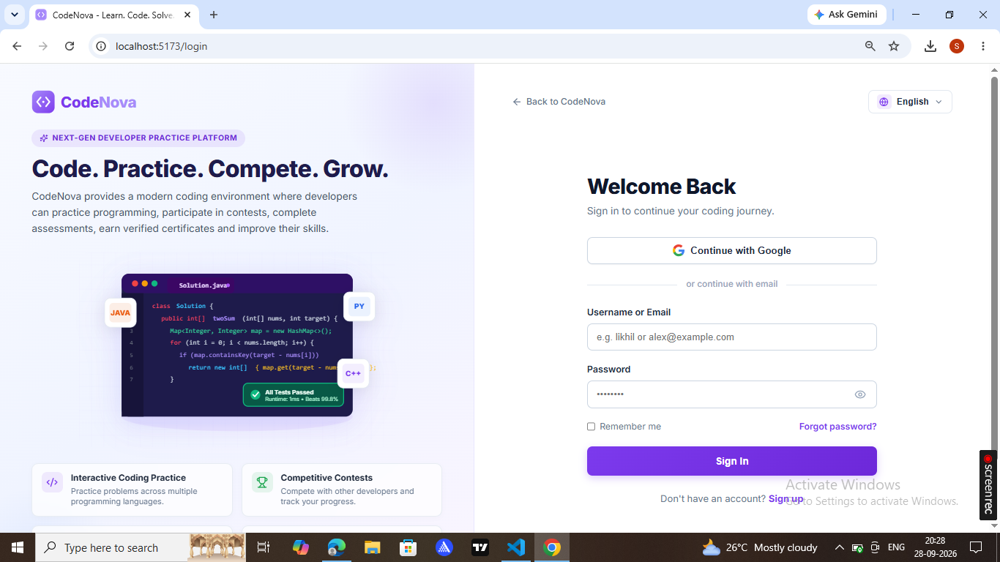 | 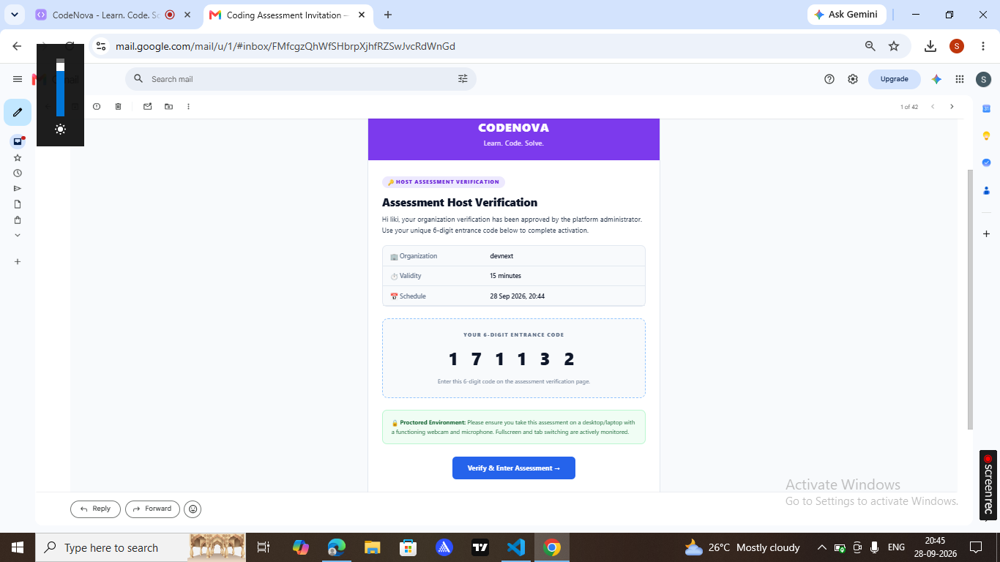 |

| Candidate Dashboard | Progress & Analytics |
|:---:|:---:|
| 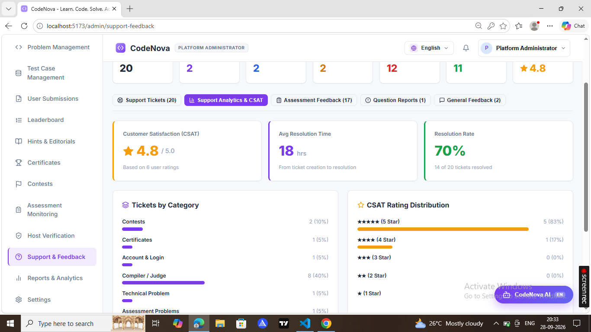 | 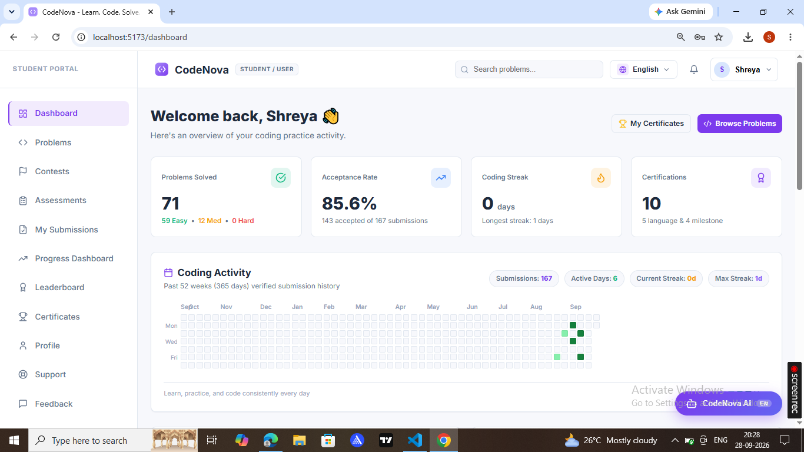 |

### Problem Solving & Monaco Editor
| Coding Problem Interface | Submission & Output Breakdown |
|:---:|:---:|
| 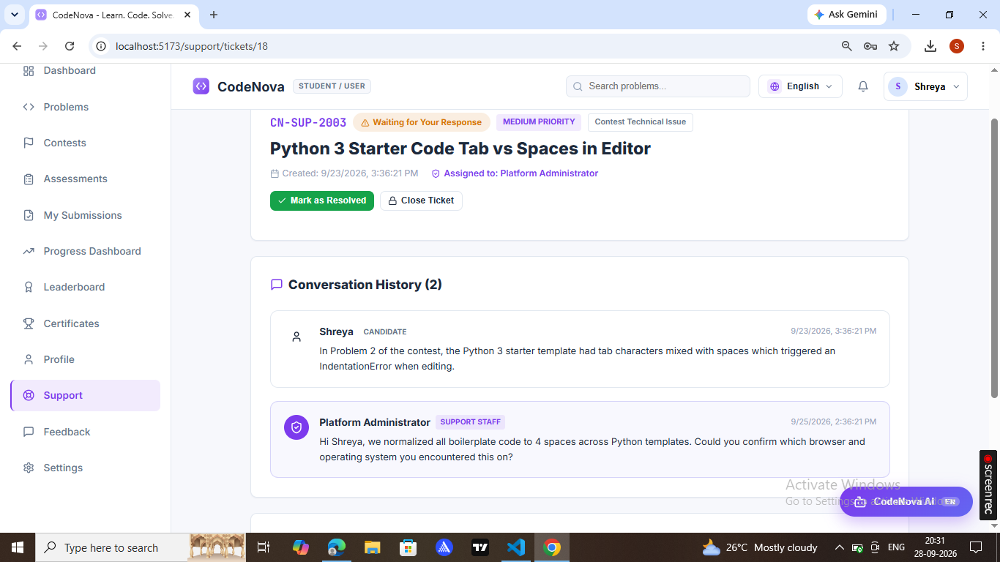 | 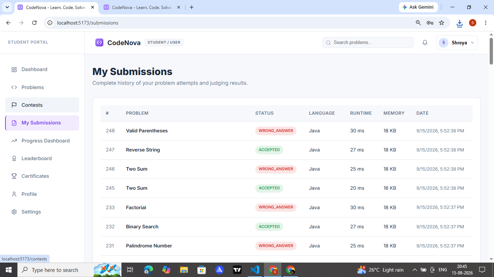 |

### Skill Assessments & Proctoring
| Assessment Overview | Timed Attempt Interface |
|:---:|:---:|
| 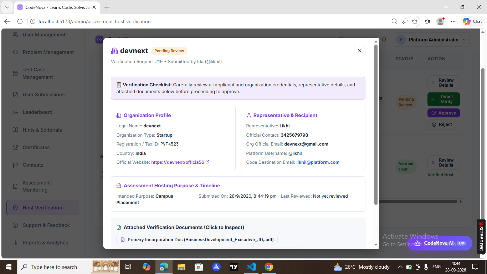 | 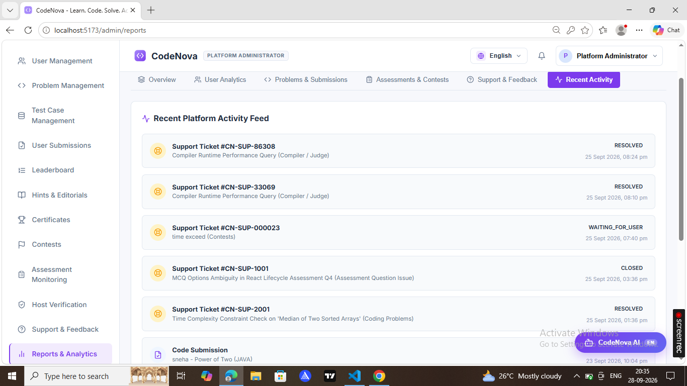 |

| Final Score & Explanations | Host Assessment Verification |
|:---:|:---:|
| 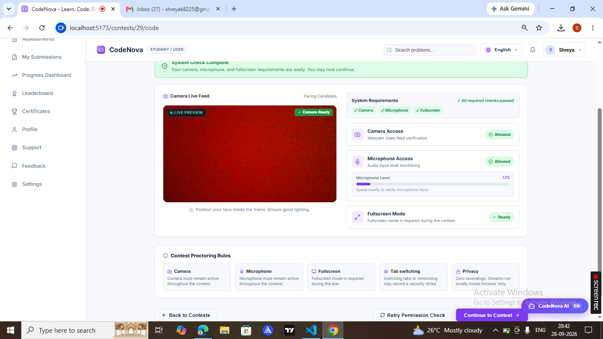 | 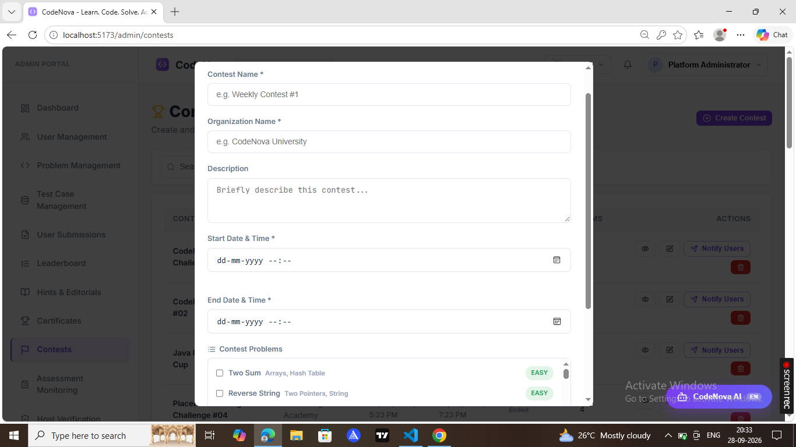 |

### Contests & Live Leaderboards
| Active Contests List | Live Leaderboard |
|:---:|:---:|
| 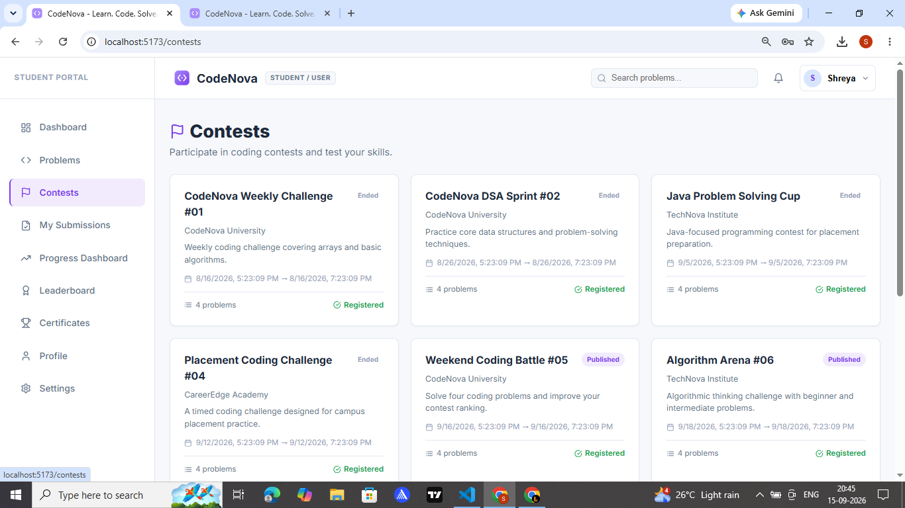 | 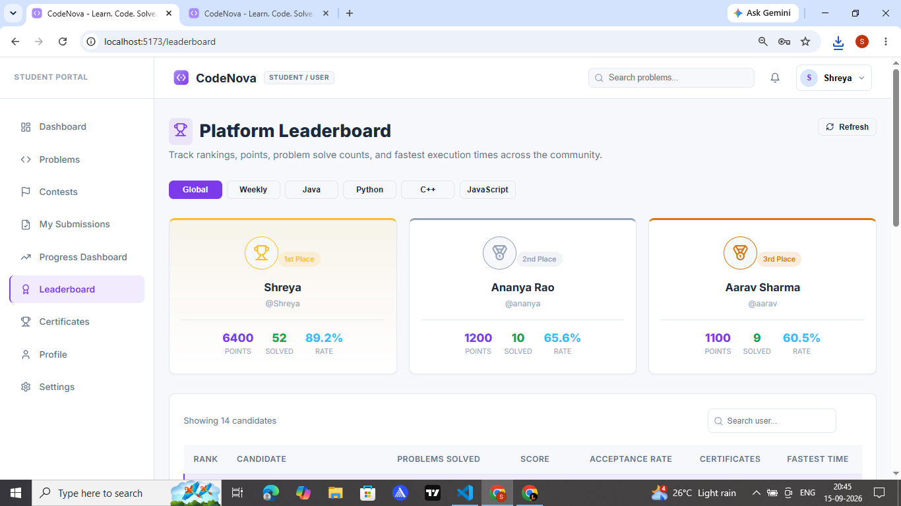 |

### Support Ticketing & Admin Console
| Candidate Support Desk | Admin Ticket Management |
|:---:|:---:|
| 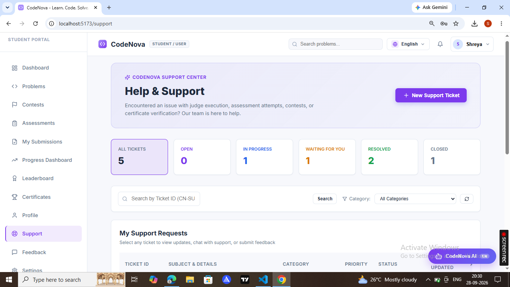 | 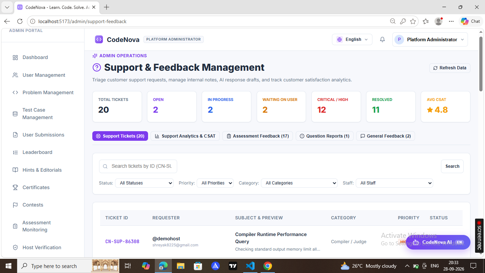 |

| Admin Reports & Analytics | Host Verification Approvals |
|:---:|:---:|
| 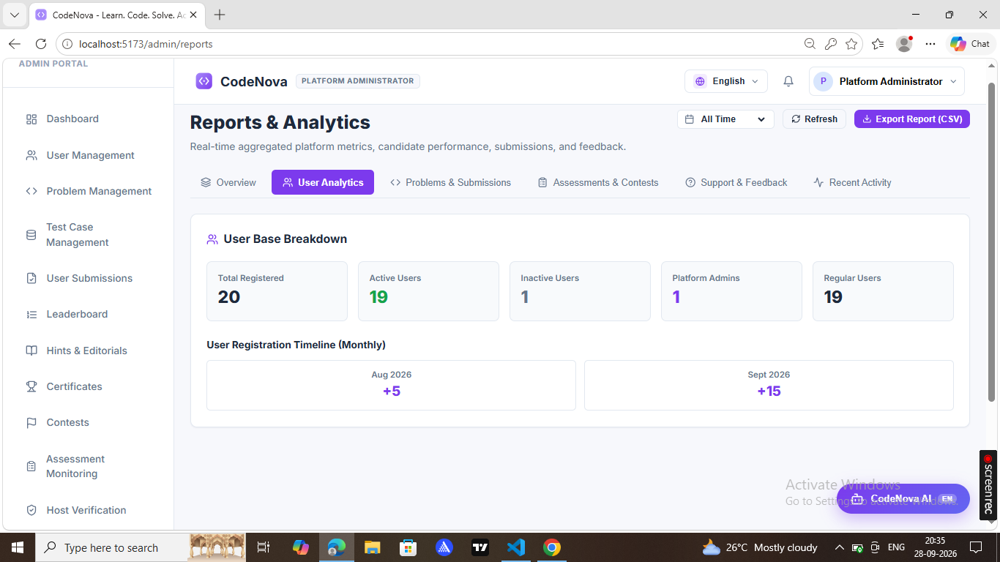 | 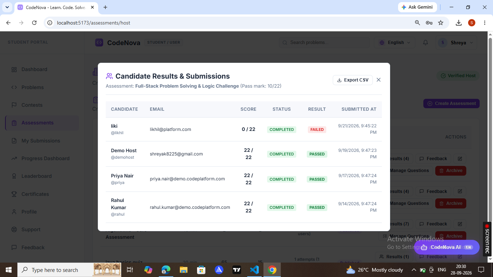 |

---

## API Overview

### Authentication & Users
| Method | Endpoint | Description | Auth Required |
|---|---|---|---|
| `POST` | `/api/auth/register` | Register new user account | Public |
| `POST` | `/api/auth/login` | Authenticate user & return JWT token | Public |
| `GET` | `/api/auth/me` | Fetch authenticated user profile | Candidate / Admin |
| `PUT` | `/api/users/settings` | Update language & notification settings | Candidate / Admin |

### Coding Problems & Submissions
| Method | Endpoint | Description | Auth Required |
|---|---|---|---|
| `GET` | `/api/problems` | List all active coding problems | Public |
| `GET` | `/api/problems/{id}` | Get problem details and starter template | Public |
| `POST` | `/api/submissions/run` | Execute code against sample test cases (No DB save) | Candidate |
| `POST` | `/api/submissions` | Full graded submission against hidden test cases | Candidate |
| `GET` | `/api/submissions/my` | Get candidate's personal submission history | Candidate |

### Assessments & Contests
| Method | Endpoint | Description | Auth Required |
|---|---|---|---|
| `GET` | `/api/assessments` | List published skill assessments | Public |
| `POST` | `/api/assessments/{id}/start` | Start timed assessment attempt | Candidate |
| `POST` | `/api/assessments/{id}/attempts/{attemptId}/answer` | Record atomic MCQ / True-False answer | Candidate |
| `POST` | `/api/assessments/{id}/attempts/{attemptId}/submit` | Final assessment grading & submit | Candidate |
| `GET` | `/api/contests` | List active, upcoming, and past contests | Public |
| `POST` | `/api/contests/{id}/register` | Register for competitive contest | Candidate |
| `GET` | `/api/leaderboard` | Get global platform & contest leaderboard | Public |

### Support, Feedback & Admin
| Method | Endpoint | Description | Auth Required |
|---|---|---|---|
| `GET` | `/api/support/tickets/my` | List candidate support tickets | Candidate |
| `POST` | `/api/support/tickets` | Create new support ticket with attachments | Candidate |
| `POST` | `/api/support/tickets/{id}/messages`| Add message/reply to support ticket thread | Candidate / Admin |
| `GET` | `/api/admin/support/tickets` | List and filter all platform tickets | **Admin Only** |
| `PATCH`| `/api/admin/support/tickets/{id}/status` | Update ticket status (`IN_PROGRESS`, `RESOLVED`, etc.) | **Admin Only** |
| `GET` | `/api/admin/reports` | Get platform aggregate analytics & metrics | **Admin Only** |

---

## Execution & Proctoring Engine

1. **Solution-Class Model**: Students only implement algorithm methods (e.g. `public int[] twoSum(int[] nums, int target)`).
2. **Dynamic Driver Generation**: The backend generates a runtime `Main.java` driver that reflects on declared parameter types, parses test inputs accurately, and compares output with normalized formatting.
3. **Proctoring Integrity**: Browser event listeners detect tab switches (`visibilitychange`) and fullscreen cancellations (`fullscreenchange`). The server terminates the attempt if violations exceed safety limits.

---

## Support Ticketing & Email System

- **Safe Non-Blocking SMTP**: Asynchronous delivery via `CompletableFuture` ensures API endpoints respond instantly even during mail server latencies.
- **Dynamic HTML Templates**: Responsive email layouts with XSS-sanitized inputs.
- **Lifecycle Events**:
  - `Ticket Created` ➔ Confirmation with ticket ID (`SUP-100X`).
  - `Staff Reply` ➔ Direct response summary sent to candidate.
  - `Resolved / Closed` ➔ Resolution notice with re-open link.
  - `Assessment & Contest Results` ➔ Score, percentage, and badge delivery.

---

## Demo Credentials

| Username | Password | Role | Description |
|---|---|---|---|
| `admin` | `admin123` | **ROLE_ADMIN** | Platform Administrator with full management & analytics access |
| `alexj` | `password123` | **ROLE_USER** | Candidate with completed assessments and submission history |
| `shreya` | `password123` | **ROLE_USER** | Candidate account with active assessments and tickets |
| `likhil` | `password123` | **ROLE_USER** | Candidate account with contest and support history |

---

## Author

Developed by **Shreya K** and team as part of the **Online Coding Practice and Skill Assessment Management Platform** initiative.

